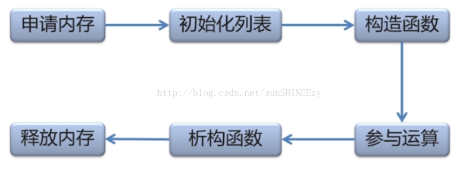

### 预处理和宏
```c++
#include "stdafx.h"
#include<stdio.h>
#define DEBUG

#ifdef DEBUG
#endif
```

```c++
//宏是简单的字符串替换
#define SQR(X)(X*X)
a=SQR(b+2);//a = b+2*b+2
#define SQR(X)((X)*(X))
a=SQR(b+2);//a = (b+2)*(b+2)
```

```c++
#define INF 0x3f3f3f3f
//0x7fffffff 32位int最大值
//无穷大加无穷大依然是无穷大(不会溢出)
//INF=0x3f3f3f3f 
//其中long 和 int 范围是[-2^31,2^31)，即-2147483648~2147483647。而unsigned范围是[0,2^32)，即0~4294967295。
//VC的64位整数分别叫做__int64与unsigned __int64，其范围分别是[-2^63, 2^63)与[0,2^64)
```

```C++
#if DLEVEL > 5  
    #define SIGNAL  1  
    #if STACKUSE == 1  
        #define STACK   200  
    #else  
        #define STACK   100  
    #endif  
#else  
    #define SIGNAL  0  
    #if STACKUSE == 1  
        #define STACK   100  
    #else  
        #define STACK   50  
    #endif  
#endif  
#if DLEVEL == 0  
    #define STACK 0  
#elif DLEVEL == 1  
    #define STACK 100  
#elif DLEVEL > 5  
    display( debugptr );  
#else  
    #define STACK 200  
#endif  
```


### 二、动态内存分配

```c++
//类型名 *指针变量 = new 类型名
i = 5;
int *pNum = new int[i];
delete [] pNum;
//new分配的时候，一般会分配除了它本身大小以外的内存头和内存尾，一般形式为：[内存头][可用数据][内存尾]。而你的ptr指针返回的是[可用数据]部分的起始地址。大部分编译器在用户分配的size为0的情况下，会自动分配1字节的可用内存，以保证返回的ptr是一个合法的指针。但是，C/C++是一个从来都不校验内存溢出的语言。因此，你可以访问任意从ptr开始的地址的数据，如果你访问的地址正巧有数据，则这个数据就会被访问到，如果正好这个地址没分配数据，才会抛出异常。
//delete 释放new分配的单个对象指针指向的内存 delete[] 释放new分配的对象数组指针指向的内存
//delete ptr 代表用来释放内存，且只用来释放ptr指向的内存。
//delete[] rg 用来释放rg指向的内存，！！还逐一调用数组中每个对象的destructor！！
//对于像int/char/long/int*/struct等等简单数据类型，由于对象没有
//destructor，所以用delete 和delete [] 是一样的！但是如果是C++对象数组就不同了！
```

```c++
short *p = (short*)malloc(len * sizeof(short));
free(p);
//malloc 必须要由我们计算字节数，并且在返回后强行转换为实际类型的指针。
```

```c++
//需要通过输入确定数组大小，此时不能通过
//cin>>n;
//int v[n];
//因为这是静态数组，所以需要使用动态数组

//一维数组
int n;
cin>>n;
int *a=new int[n];
delete []a; 
//二维数组
cin>>m>>n;
int **a=new int *[m];
for(int i=0;i<m;i++)
    a[i]=new int[n];

for(int i = 0; i < m; ++i)
    delete []a[i];
delete []a; 
```

### 三、指针和寻址

int *p = (int *)malloc(sizeof(int)*5);

野指针问题：

 使用delete删除指针需小心 “野指针”我们在删除一个指针之后，编译器只会释放该指针所指向的内存空间，而不会删除这个指针本身。指针还可以继续访问。

编译器默认将释放掉的内存空间回收然后分配给新开辟的空间。所 以在第11行由于我们新开辟了一个可以保存long型变量的空间并且由p1来指向它，那么这里的p1指向的其实就是在程序第8行释放掉的内存空间，即p指向的内存空间！

在删除一个指针之后，一定将该指针设置成空指针（即在delete *p之后一定要加上： p=NULL）

      我们来看一下在stdio.h中关于关键字NULL的定义：

1

2

3
#ifndef NULL
4
#ifdef __cplusplus
5
#define NULL    0
6
#else
7
#define NULL    ((void *)0)
8
#endif
9
#endif


01
#include
02
using namespace std;
03

04
int main()
05
{
06
​    int *p=new int;
07
​    if (p==NULL)
08
​    {
09
​        //判断指针p是不是空指针，如果是空指针，那么程序在这里就应该报错
10
​        //报错的方法有很多，比如说返回一个ERROR值：
11
​        //return ERROR;
12
​    }
13

14
​    //判断了操作成功之后我们才能进行一系列的操作
15
​    //...
16

17
​    //用完指针p之后，一定要将其删掉。这样可以杜绝野指针的存在
18
​    delete p;
19
​    //删除指针p之后，一定要加上下面这句话，免得成为野指针
20
​    p=NULL;
21
}


1111 1111 1111 1111 1111 1111 1111 1100（-4的二进制表示）。而__int64是一个64位的，所以完全可以把
1111 1111 1111 1111 1111 1111 1111 1100存放下来，而不发生数据截断。所以此时
1111 1111 1111 1111 1111 1111 1111 1100被解释成4294967292，而不是-4！

int *b = &a;
等价于
int *b;
b = &a;
b中存的地址跟a的地址一样！修改\*b 等同于修改a

**&a返回类型为(int*）**


    int *p = new int(32769);
    int *p2 = new int;
    int *p3 = new int;
    *p2 = 32769;


    cout<<p<<endl<<p2<<endl<<p3;
结果
0x676340
0x676350
0x676360
相差16是为了方便地址对齐。

这个在计算机组成原理里面叫地址对齐，地址是16字节的，那么16字节的倍数的对齐就方便了计算机去寻址。
而且你不能固话的理解他是16字节的倍数，地址的分配是编译器行为。

address_str1= 0x7ffcdede0a2b
address_str2= 0x7ffcdede0a29

实际上指针代表的是寻地址，指针长度实际上和最大的寻址长度是有关系的，32位机的最大寻址长度为4Byte，所以实际上sizeof(p)就是指针p的地址，那肯定是4呀！但是8位单片机，16位单片机和64位单片机就不一样了，如果8位的单片机用8位的编译器编译，sizeof(p)必是1。我们有时候发现为啥我们用64位的电脑编译，发现sizeof(p)=4呢，因为我们用的编译器是32位的。

对于双通道内存来说，它一次性可以访问128b/256b的内存，也就是16/32字节，那么如果数据不对齐，就需要额外的时钟周期访问，就很低效。


32位机=指针地址长度为32位=指针大小4字节


根据运算优先级，*与++时同一优先级，因此无法直接判定结合性，又由于一元运算符具有由右向左结合，因此*p++ 等价于*（p++）,即先将指针后移，然后取值


int a[5];
int *a = new int[5];


数组名是数组的首地址!!


[]静态数组和new分配的动态数组的区别：

静态数组栈，动态数组堆！！！所以函数返回后，栈中的东西被自动释放，而堆中的东西如果没有delete不会自动释放

一、对静态数组名进行sizeof运算时，结果是整个数组占用空间的大小；
因此可以用sizeof(数组名)/sizeof(*数组名)来获取数组的长度。
int a[5]; 则sizeof(a)=20,sizeof(*a)=4.因为整个数组共占20字节，首个元素（int型）占4字节。
int *a=new int[4];则sizeof(a)=sizeof(*a)=4,因为地址位数为4字节，int型也占4字节。

二、静态数组作为函数参数时，在函数内对数组名进行sizeof运算，结果为4，因为此时数组名代表的指针即一个地址，占用4个字节的内存(因为在传递数组名的参数时，编译器对数组的长度不做检查，具体可参考前面一篇c++对数组的引用实例分析)。对动态数组的函数名，无论何时进行sizeof运算，得到的结果都是4.

三、new还需要你delete，是在堆分配空间，效率较低；而[]直接在栈上分配，会自动释放，效率高，但是栈空间有限。

四、通过函数返回一个数组的问题

函数声明的静态数组不可能通过函数返回，因为生存期的问题，函数调用完其内部变量占用的内存就被释放了。如果想通过函数返回一个数组，可以在函数中用new动态创建该数组，然后返回其首地址。
其原因可以这样理解，因为[]静态数组是在栈中申请的，而函数中的局部变量也是在栈中的，而new动态数组是在堆中的分配的，所以函数返回后，栈中的东西被自动释放，而堆中的东西如果没有delete不会自动释放。

### 四、c++构造函数成员变量的初始化

**以下三种情况下需要使用初始化成员列表：**

一，需要初始化的数据成员是对象的情况；

二，需要初始化const修饰的类成员；

三，需要初始化引用成员数据；

C++可以定义引用类型的成员变量，引用类型的成员变量必须在构造函数的初始化列表中进行初始化。对于类成员是const修饰，或是引用类型的情况，是不允许赋值操作的，(显然嘛，const就是防止被错误赋值的，引用类型必须定义赋值在一起)，因此只能用初始化列表对齐进行初始化。成员类型是没有默认构造函数的类。若没有提供显示初始化式，则编译器隐式使用成员类型的默认构造函数，若类没有默认构造函数，则编译器尝试使用默认构造函数将会失败。（也就是这三种情况必须使用初始化列表）


**使用默认参数时的注意事项：**

 

① 有函数声明(原型)时,默认参数可以放在函数声明或者定义中，但只能放在二者之一

```c++
double sqrt(double f = 1.0); //函数声明

double sqrt(double f)  //函数定义
{
  // ....  
} 
```

② 没有函数(原型)时,默认参数在函数定义时指定.

```c++
//没有 函数声明

double sqrt(double f = 1.0)  //函数定义
```

③ 在具有多个参数的函数中指定默认值时,默认参数都必须出现在不默认参数的右边,一旦某个参数开始指定默认值,它右边的所有参数都必须指定默认值.

```c++
int f (int i1, int i2 = 2, int i3 = 3);     // 正确
int g (int i1, int i2 = 2, int i3);         // 错误, i3未指定默认值
int h (int i1 = 1, int i2, int i3 = 3);     // 错误, i2未指定默认值
```

④ 在调用具有默认参数的函数时, 若某个实参默认,其右边的所有实参都应该默认。

```c++
//例如, 一个函数声明如下
int f(int i1 = 1, int i2 =2, int i3 = 3);


//调用函数 f()
f();             //正确, i1=1, i2=2, i3=3
f(3);            //正确, i1=3, i2=2, i3=3
f(2, 3);         //正确, i1=2, i2=3, i3=3
f(4, 5, 6);      //正确, i1=4, i2=5, i3=6
f(, 2, 3);       //错误, i1默认,其右边的i2和i3没有默认
```

### c++ 类

 C++变量初始化

首先，C++变量初始化有2种方法，直接初始化和复制初始化。复制初始化就是使用=号的初始化，而直接初始化就是使用()符号进行的初始化。 
 比如：

```
int age(20);  //直接初始化，编译器会调用构造函数直接赋值
int age = 20; //复制初始化  先调用直接构造函数创建一个临时的对象，然后再调用复制构造函数进行赋值
```

**有时候，有些不支持复制的类型，就不能用复制初始化了。**


**构造函数：**构造函数执行分为两个阶段：

a.初始化阶段(初始化)

初始化阶段具体指的是用构造函数初始化列表方式来初始化类中的数据成员。 ClassXX:val(a),key(b){};

b.普通计算阶段(赋值)

给类中的数据成员重新赋值，会覆盖初始化阶段数据成员的值。

ClassXX{val = a,key = b};


这两个阶段按照顺序执行。

对于普通数据成员而言，其值的设定可以放在 初始化阶段或者普通计算阶段完成。

对于  const类型和&引用类型数据成员，其初始化**必须**在初始化阶段完成。若通过

普通计算阶段来初始化该值，编译器会报错：该变量未初始化。

**注意：引用型变量初始化时候必须使用相同类型的 *变量* 来初始化，不可使用常量初始化。**


还有就是这中直接调用构造函数的方式，还有可能造成野指针，例如：
A* ptr = &A(5)；
在临时对象消失之后，ptr成为了野指针。

如果想要延长临时对象生存周期，有一种方法是对它进行const引用：
const A& a = A(5);
a是A（5）对象的引用或者别名，而且必须要以const形式才能绑定临时对象。这样只要a存在，由A(5)产生的临时对象就会存在。


**析构函数：**不是动态分配内存的话，不写没多大关系！！！反之一定要写！！

析构函数特点： 

- 如果没有自定义的析构函数，则系统自动生成
- 析构函数在对象销毁时自动调用（与之相对应，构造函数在对象实例化时自动调用）
- 析构函数没有返回值（构造函数也是如此）、没有参数也不能重载
- 不允许在()内加任何的参数

生命周期：



总结：构造函数与析构函数的调用顺序

1、先执行 被组合对象的构造函数

（1）当类中有成员变量是其他类的对象时，首先调用成员变量的构造函数，调用顺序与声明顺序相同，之后调用自身类的构造函数。

（2）析构函数的调用顺序与对应的构造函数调用顺序相反。

2、被组合对象的构造顺序，预定义顺序有关系，与初始化列表的顺序没有关系

**3、 特殊成员变量必须用参数列表初始化。const、&、对象。**

**4、static类型的成员变量，必须在类外初始化，且不带static关键字。**

 **注意：构造函数中不要调用构造函数！！这是一种危险的行为！（匿名对象深究）语句执行结束，匿名对象会被析构**


### 六、new

当我们使用关键字new在堆上动态创建一个对象时，它实际上做了三件事：**获得一块内存空间、调用构造函数、返回正确的指针**。

malloc是函数，new是关键字

```c++
int *p=new int(3);
cout << *p << endl;

//以上new语句等于
int *p = (int*)malloc(sizeof(int));//必须通过 (int *) 来将强制转换
p->int::int(3);

//或者：

int temp = int(3);
int *p = &temp; 
```

new 自定义内存空间上构造对象

```c++
void *buffer = malloc(sizeof(ClassA));
ClassA *ptr = new(buffer)ClassA();
```


### 七、->和.和::和:

->是指针类型引用类中普通成员

.是实例化对象对类中普通成员的引用，成员提取

*xy.name="hhhhh";等价于xy->name="hhhhh";

::作用域符号

:表示继承


::是运算符中等级最高的，它分为三种：全局作用域符，类作用域符，命名空间作用域符

 **全局作用**

全局作用域符号：当全局变量在局部函数中与其中某个变量重名，那么就可以用::来区分如：  
 　　char ch; //全局变量  
 　　void sleep（）  
 　　{  
 　　char ch; //局部变量  
 　　ch(局部变量) = ch(局部变量) *ch(局部变量) ;  
 　　::ch(全局变量) =::ch(全局变量) *ch(局部变量);  
 　　}

**类作用域符号**

类作用域符号::的前面一般是类名称，后面一般是该类的成员名称，C++为了避免不同的类有名称相同的成员而采用作用域的方式进行区分。 
 　　例如A,B表示两个类，在A,B中都有成员member，那么 
 　　A::member就表示类A中的成员member 
 　　B::member就表示类B中的成员member 
 　　

**命名空间**

“::”是作用域限定符或者称作用域运算符或者作用域操作符（scope operator），例如命名空间。 
 “::”作用：namespace::name 
​     :: 的另一种用法 
​     直接用在全局函数前，表示是全局函数。当类的成员函数跟类外的一个全局函数同名时，在类内定义的时候，用此函数名默认调用的是本身的成员函数；如果要调用同名的全局函数时，就必须打上::以示区别。

### 八、const 和 临时对象

const 对象特点

1，只能作为右值
2，只能调用对象的const方法
临时对象特点

1，只有作为为 const& 赋值 给其它对象
2，可以调用对象的非 const方法 //但是这样是无效的改变，修改信息会被丢失
解决方法

约定： 除赋值运算外的其他运算符在重载时返回const 临时对象
//ps：赋值运算返回对象引用，方便连缀表达式（如” (a=b).f()”）

**const对象只能访问const成员函数,而非const对象可以访问任意的成员函数,包括const成员函数**

**const的用法，特别是用在函数后面**

**void xxx（）const{}**

在普通的非 const成员函数中，this的类型是**一个指向类类型**的 const指针。可以改变this所指向的值，但不能改变 this所保存的地址。

在 const成员函数中，**this的类型是一个指向 const类类型对象的 const指针**。既不能改变 this所指向的对象的值，也不能改变 this所保存的地址。


```c++
A* ptr = &A(5)；//=操作符复制了右边的地址到左边指针，临时变量只有一句话的生命，ptr会变成野指针（taking address of temporary ）
A ptr = A(5)；//=操作符复制了右边的内容到左边，浅拷贝
const A& a = A(5);//&在此不是求地址运算，它是变量的引用，即别名
//1）引用在赋值=的左边，而取地址在赋值的右边,2）和类型在一起的是引用，和变量在一起的是取址
//引用传递和指针传递都可以修改实参，引用传递的就是实参（别名），指针传递的是指向实参的地址（地址可以改变，即指向其他内存）
```


构造函数是一个特殊的函数：

- 是否可以直接调用？
- 是否可以在构造函数中调用构造函数？（**1.初始化列表（委托构造函数），2. new内存覆盖new (this) Test(b)**）
- 直接调用构造函数的行为是什么？

答案：

- 直接调用构造函数将产生一个临时对象
- 临时对象的生命周期只有一条语句的时间
- 临时对象的作用域只在一条语句中


### 九、静态static

用于返回局部变量（延长生命周期，函数结束内存不释放），用于保护全局变量（其他文件不可访问）

（1）在修饰变量的时候，static修饰的静态局部变量只执行初始化一次，而且延长了局部变量的生命周期，直到程序运行结束以后才释放。
（2）static修饰全局变量的时候，这个全局变量只能在本文件中访问，不能在其它文件中访问，即便是extern外部声明也不可以。
（3）static修饰一个函数，则这个函数的只能在本文件中调用，不能被其他文件调用。Static修饰的变量存放在全局数据区的静态变量区，包括全局静态变量和局部静态变量，都在全局数据区分配内存。初始化的时候自动初始化为0。
（4）不想被释放的时候，可以使用static修饰。比如修饰函数中存放在栈空间的数组。如果不想让这个数组在函数调用结束释放可以使用static修饰。
（5）考虑到数据安全性（当程序想要使用全局变量的时候应该先考虑使用static）。

### 十、string类

1. 默认构造函数:
    1. 判断参数是否为空（默认为空）2. 赋值成员变量前要先申请内存（动态new）！
2. 拷贝构造函数
    1. 参数不修改则用const  2.先申请内存再赋值
3. operator =
    1. strlen()不计算'\0'结束符 2.先判断是否相等（用地址判断），相等则返回*this 3.不等则删除内存delete [] m_data, 在申请内存后，再copy！！！
4. strcpy一定会在赋值结束后在串尾补一个结束符'\0'
5. 析构函数删除m_data


重载操作符，返回引用比返回指针好！！！

C++里引用其实只是受限的指针，只是在语义上限制不能对引用这一受限的指针做一些指针能做的操作：重新赋值，拷贝，++，--（暂时还没有想到其他的），并限制不允许为空，以提高安全性，可以理解为是编译器对指针的一种保护模式。

合理使用语义暗示，指针暗示拥有（has），引用暗示关联(use)：

容器中不可保存引用，只能用指针

### 写出类的 copy ,operator = == +函数

### const 的三种用法！！！

①const Stock & Stock::topval (②const Stock & s) ③const {}

我们把三处const分别用序号①②③分别表示，分别讲解。

①处const：确保返回的Stock对象在以后的使用中不能被修改

②处const：确保此方法不修改传递的参数 S

③处const：保证此方法不修改调用它的对象，这是把整个函数修饰为const，意思是“函数体内不能对成员数据做任何改动”。

**1. const对象只能调用const成员函数。**         

**2. 在const成员函数中修改对象数据成员的值是语法错误 。**      

**3. 在const函数中调用非const成员函数是语法错误**

```c++
#include <iostream>

class A{
public:
	int fun() const 
	{
		return 1;
	}

	int fun() 
	{
		return 2;
	}

	void display()
	{
		std::cout << fun() << std::endl;//默认调用了函数fun的非const版本
		//问题：此处能否调用函数fun的const版本？ 怎么调用？
	}
};

int main() {
	A  a;
	const A  b;

	a.display();
	std::cout << ((const A&)a).fun() << std::endl;
	std::cout << const_cast<A&>(b).fun() << std::endl;
	return 0;
}

```

在fun()的两个版本同时存在时，display()如何调用fun()的const版本？

1. **const对象默认调用const成员函数，非const对象默认调用非const成员函数；**
2. **若非const对象想调用const成员函数，则需显式转化，如((const A)a).fun();**
3. **若const对象想调用非const成员函数，同理const_cast<A&>(A).fun();**

**当类中只有函数的const或非const版本存在的情况下：**

1. **非const对象可以调用const成员函数或非const成员函数；**
2. **const对象只能调用const成员函数，直接调用非const函数时编译器会报错；**


### new delete 

void *operator new(size_t);     //allocate an object
void *operator delete(void *);    //free an object
void *operator new\[](size_t);     //allocate an array
void *operator delete\[](void *);    //free an array


### 容器比较

list支持快速的插入和删除，但是查找费时;

vector支持快速的查找，但是插入费时。

**map查找的时间复杂度是对数的，这几乎是最快的，hash也是对数的。** 
如果我自己写，我也会用二叉检索树，它在大部分情况下可以保证对数复杂度，最坏情况是常数复杂度，而std::map在任何情况下都可以保证对数复杂度，原因是它保证存诸结构是完全二叉检索树，但这会在存诸上牺牲一些时间


为什么说   hash_map   是对数级的？在不碰撞的情况下，hash_map是所有数据结构中查找最快的，它是常数级的。 
如果对问题设计了足够好的hash[算法](http://www.haogongju.net/tag/%E7%AE%97%E6%B3%95)，保证碰撞率很低，hash_map的查找效率无可置疑。 
另外，**STL的map，它的查找是对数级的，是除hash_map外最高的了**，你可以说“也许还有改进余地”，但对于99.9999%的[程序员](http://www.haogongju.net/tag/%E7%A8%8B%E5%BA%8F%E5%91%98)，设计一个比STL   map好的map，我执悲观态度。 
STL的map有平衡策略（比如红黑树什么的），所以不会退化，不需要考虑数据本身的分布问题。**只不过，如果数据本身是排好序的，用vector或heap会明显的快些，因为它们的访问比较简单。**


**rb-tree的时间花在了插入和删除上，如果你不是对插入和删除效率要求很高，你没有理由不选择基于rb-tree的stl::map。**


**你的百万级的数据放到vector不大合适。因为vector需要连续的内存空间，显然在初始化这个容器的时候会花费很大的容量。 使用map，你想好了要为其建立一个主键吗？如果没有这样的需求，为什么不考虑deque或者list？ map默认使用的是deque作为容器。其实map不是容器，拿它与容器比较意义不大。因为你可以配置它的底层容器类型。**


**如果你需要在数据中间进行插入，list 是最好的选择，vector   的插入效率会让你痛苦得想死。**


**涉及到查找的话用map比较好，因为map的内部数据结构用rb-tree实现，而用vector你只能用线性查找，效率很低。**

**stl还提供了 hash容器，理论上查找是飞快~~~。做有序插入的话vector是噩梦，map则保证肯定是按key排序的，list要自己做些事情。**

 

**HASH类型的查找肯定快，是映射关系嘛，但是插入和删除却慢，要做移动操作, LIST类型的使链式关系，插入非常快，但是查找却费时，需要遍历~~ , 还是用LIST类型的吧，虽然查找慢点，**

**先快速排序，然后二分查找，效率也不低**


List封装了链表,Vector封装了数组, list和vector得最主要的区别在于vector使用连续内存存储的，他支持[]运算符，而list是以链表形式实现的，不支持[]。

Vector对于随机访问的速度很快，但是对于插入尤其是在头部插入元素速度很慢，在尾部插入速度很快。List对于随机访问速度慢得多，因为可能要遍历整个链表才能做到，但是对于插入就快的多了，不需要拷贝和移动数据，只需要改变指针的指向就可以了。另外对于新添加的元素，Vector有一套算法，而List可以任意加入。
Map,Set属于标准关联容器，使用了非常高效的平衡检索二叉树：红黑树，他的插入删除效率比其他序列容器高是因为不需要做内存拷贝和内存移动，而直接替换指向节点的指针即可。
Set和Vector的区别在于Set不包含重复的数据。Set和Map的区别在于Set只含有Key，而Map有一个Key和Key所对应的Value两个元素。
Map和Hash_Map的区别是Hash_Map使用了Hash算法来加快查找过程，但是需要更多的内存来存放这些Hash桶元素，因此可以算得上是采用空间来换取时间策略。


  双端队列 double-end queue
   deque是在功能上合并了vector和list。
   优点：(1) 随机访问方便，即支持[ ]操作符和vector.at()
​               (2) 在内部方便的进行插入和删除操作
​               (3) 可在两端进行push、pop
   缺点：(1) 占用内存多
**使用区别：**
​     1 如果你需要高效的随即存取，而不在乎插入和删除的效率，使用vector 
​     2 如果你需要大量的插入和删除，而不关心随即存取，则应使用list 
​     3 如果你需要随即存取，而且关心两端数据的插入和删除，则应使用deque


 map默认使用的是deque作为容器。其实map不是容器，


### 多态：

**1. 函数多态**

​     也就是我们常说的函数重载（function overloading）。基于不同的参数列表，同一个函数名字可以指向不同的函数定义：  


**动态多态**

​     这就是众所周知的的多态。现代面向对象语言对这个概念的定义是一致的。其技术基础在于继承机制和虚函数。例如，我们可以定义一个抽象基类Vehicle和两个派生于Vehicle的具体类Car和Airplane： 


您可能想要在基类中定义虚函数，以便在派生类中重新定义该函数更好地适用于对象，但是您在基类中又不能对虚函数给出有意义的实现，这个时候就会用到纯虚函数。


```c++
#include <iostream>

// 公共抽象基类Vehicle
class Vehicle
{
public:
    virtual void run() const = 0;
};

// 派生于Vehicle的具体类Car
class Car: public Vehicle
{
public:
    virtual void run() const
    {
        std::cout << "run a car\n";
    }
};

// 派生于Vehicle的具体类Airplane
class Airplane: public Vehicle
{
public:
    virtual void run() const
    {
        std::cout << "run a airplane\n";
    }
}; 
//客户程序可以通过指向基类Vehicle的指针（或引用）来操纵具体对象。通过指向基类对象的指针（或引用）来调用一个虚函数，会导致对被指向的具体对象之相应成员的调用：

// dynamic_poly_1.cpp

#include <iostream>
#include <vector>
#include "dynamic_poly.h"

// 通过指针run任何vehicle
void run_vehicle(const Vehicle* vehicle)
{
    vehicle->run();            // 根据vehicle的具体类型调用对应的run()
}

int main()
{
    Car car;
    Airplane airplane;
    run_vehicle(&car);         // 调用Car::run()
    run_vehicle(&airplane);    // 调用Airplane::run()
}

//此例中，要害的多态接口元素为虚函数run()。由于run_vehicle()的参数为指向基类Vehicle的指针，因而无法在编译期决定使用哪一个版本的run()。在运行期，为了分派函数调用，虚函数被调用的那个对象的完整动态类型将被访问。这样一来，对一个Car对象调用run_vehicle()，实际上将调用Car::run()，而对于Airplane对象而言将调用Airplane::run()。 
```

```c++
virtual int area() = 0;
//= 0 告诉编译器，函数没有主体，上面的虚函数是纯虚函数。
```

定义一个函数为虚函数，不代表函数为不被实现的函数。

定义他为虚函数是为了允许用基类的指针来调用子类的这个函数。

定义一个函数为纯虚函数，才代表函数没有被实现。

定义纯虚函数是为了实现一个接口，起到一个规范的作用，规范继承这个类的程序员必须实现这个函数。


-> 派生出！


