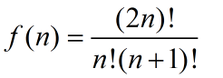
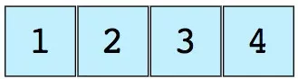
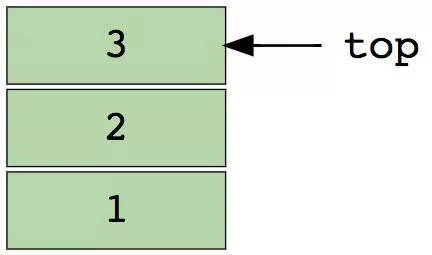
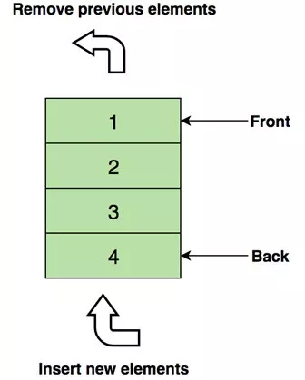
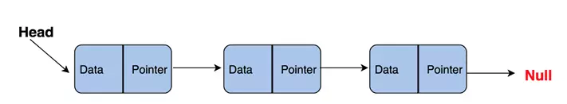
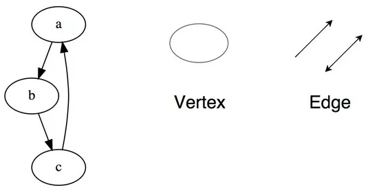
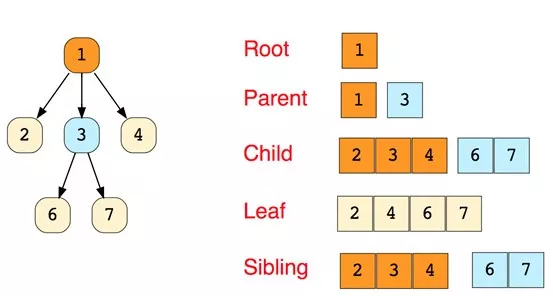
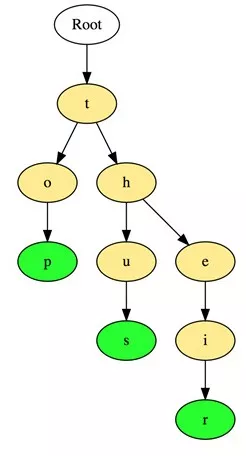
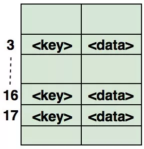

给定n个不同的整数以及一棵结构已经确定的有n个 节点的二叉树，现在需要将这些整数填充到这个二叉树的节点上，请问有多少种填充方式使得填充后的二叉树是一棵二叉查找树

### 第一题、给定n个不同的整数以及一棵结构已经确定的有n个 节点的二叉树，现在需要将这些整数填充到这个二叉树的节点上，请问有多少种填充方式使得填充后的二叉树是一棵二叉查找树（唯一）

二叉树是每个节点最多有两个子树的树结构。它有五种基本形态：二叉树可以是空集；根可以有空的左子树或右子树；或者左、右子树皆为空。

1. 空二叉树 2. 根和空的左右子树 3. 根和左子树 4. 根和右子树 5.根和左右子树

**性质1**：二叉树第i层上的结点数目最多为 **2^{i-1}** (i≥1)。
**性质2**：深度为k的二叉树至多有**2^{k}-1**个结点(k≥1)。
**性质3**：包含n个结点的二叉树的高度至少为**log2 (n+1)**。
**性质4**：在任意一棵二叉树中，若终端结点的个数为**n0**，度为2的结点数为**n2**，则**n0=n2+1**。

1. 高度为h，并且由2{h} –1个结点的二叉树，被称为满二叉树。

2. 一棵二叉树中，只有最下面两层结点的度可以小于2，并且最下一层的叶结点集中在靠左的若干位置上。这样的二叉树称为完全二叉树。(从左到右 从上到下 填充节点)
3. 二叉查找树(Binary Search Tree)，又被称为二叉搜索树。设x为二叉查找树中的一个结点，x节点包含关键字key，节点x的key值记为key[x]。如果y是x的左子树中的一个结点，则key[y]<= key[x]；如果y是x的右子树的一个结点，则key[y] >= key[x]。（左小于根，右大于根）

(01) 若任意节点的左子树不空，则左子树上所有结点的值均小于它的根结点的值；
(02) 任意节点的右子树不空，则右子树上所有结点的值均大于它的根结点的值；
(03) 任意节点的左、右子树也分别为二叉查找树。
(04) **没有键值相等的节点**（no duplicate nodes）。

f(0)=1，f(1)=1 
f(2)=f(1)f(0)+f(0)f(1) 
f(3)=f(2)f(0)+f(1)f(1)+f(0)f(2) 
. 
. 
. 
. 
f(n)=f(n-1)f(0)+f(n-2)f(1)+……….+f(1)f(n-2)+f(0)f(n-1) 
该数列称为卡特兰数（Catalan数），该递推关系的解为：

具有n个节点的二叉树有多少种形态：C(n)=(1/(n+1))*((2*n)!/(n!*n!))！！！！

$$
f(n)=\sum_{i=0}^{n-1}f(i)f(n-1-i)
$$
同理：一个栈(无穷大)的进栈序列为1,2,3,..n,有多少个不同的出栈序列

##### 重建BST

### 第二题、以下哪个排序算法对**单向链表**排序时间复杂度最低？（归并排序）

#### 排序算法：

| 排序算法 | 平均时间复杂度 | 最坏时间复杂度 | 空间复杂度 | 是否稳定 |
| -------- | :------------- | -------------- | ---------- | -------- |
| 冒泡排序 | O（n^2）     |   O（n^2）   |     O（1）   |  是      |
| 选择排序 | O（n^2） | O（n^2） | O（1） | 不是 |
| 直接插入排序 | O（n^2） | O（n^2） | O（1） | 是 |
| 归并排序 | O（nlogn） | O（nlogn） | O（n） | 是 |
| 快速排序 | O（nlogn） | O（n^2） | O（logn） | 不是 |
| 堆排序 | O（nlogn） | O（nlogn） | O（1） | 不是 |
| 希尔排序 | O（nlogn） | O（n^2） | O（1） | 不是 |
| 计数排序 | O（n+k） | O（n+k） | O（n+k） | 是 |
| 基数排序 | O（N∗M） | O（N∗M） | O（M） | 是 |

#### 1 归并排序可以通过手摇算法将空间复杂度降到O（1），但是时间复杂度会提高。

#### 2 基数排序时间复杂度为O（N*M），其中N为数据个数，M为数据位数。

1. 时间复杂度记忆 

​        1. 冒泡、选择、直接 排序需要两个for循环，每次只关注一个元素，平均时间复杂度为O（n^2）（一遍找元素O(n)，一遍找位置O(n)）

​        2. 快速、归并、希尔、堆基于二分思想，log以2为底，平均时间复杂度为O(nlogn)

（一遍找元素O(n)，一遍找位置O(logn)）

2. 稳定性记忆-“快希选堆”（快牺牲稳定性） 

​        排序算法的稳定性：排序前后相同元素的相对位置不变，则称排序算法是稳定的；否则排序算法是不稳定的。

https://blog.csdn.net/yushiyi6453/article/details/76407640

##### 注意： 归并排序的O(nlog(n))是稳定O(nlog(n))，而快排只是平均O(nlog(n)).使用快速排序总是AC超时，归并排序则可以正确AC。

**最好情况O(nlogn)——Partition函数每次恰好能均分序列，其递归树的深度就为.log2n.+1（.x.表示不大于x的最大整数），即仅需递归log2n次； 最坏情况O（n^2）,每次划分只能将序列分为一个元素与其他元素两部分，这时的快速排序退化为冒泡排序，如果用数画出来，得到的将会是一棵单斜树，也就是说所有所有的节点只有左（右）节点的树；平均时间复杂度O(nlogn)**

#### 单向链表:

操作指针

### 第三题、进程和线程

进程是操作系统分配资源的最小单元，线程是操作系统调度的最小单元

1. 进程管理了一堆资源，并且每个进程还拥有独立的虚拟内存地址空间，会真正地拥有独立与父进程之外的物理内存。并且由于进程拥有独立的内存地址空间，导致了进程之间无法利用直接的内存映射进行进程间通信。

2. **一个进程的所有线程都是共享这个进程的同一个虚拟地址空间的，也就是说从线程的角度来说，它们看到的物理资源都是一样的，这样就可以通过共享变量的方式来表示共享资源，也就是直接共享内存的方式解决了线程通信的问题。而线程也表示一个独立的逻辑流，这样就完美解决了进程的一个大难题。**

进程通信只能采用进程间通信的方式，比如信号，管道，而不能直接采用简单的共享内存方式，原因是每个进程维护独立的虚拟内存空间，所以每个进程的变量采用的虚拟地址是不同的。多个线程通信就很简单，直接采用共享内存的方式，因为不同线程共享一个虚拟内存地址空间，变量寻址采用同一个虚拟内存

一个应用程序可以有多个进程，执行多个程序代码，多个线程只能执行一个程序代码，共享进程的代码段

进程采用父子结构，线程采用对等结构

##### 父子进程

父子相同处: 全局变量、.data、.text、栈、堆、环境变量、用户ID、宿主目录、进程工作目录、信号处理方式...

父子不同处: 1.进程ID   2.fork返回值   3.父进程ID    4.进程运行时间    5.闹钟(定时器)   6.未决信号集

多线程来解决 Linux多线程间地址空间是共享的 可参考pthread资料 产生的线程级别相同 （虽然主线程还是需要wait子线程结束） 可以直接共享变量 实际上就连打开的文件都是共享的

线程的执行顺序跟线程的创建顺序不一致 ，由操作系统调度

　**孤儿进程：一个父进程退出，而它的一个或多个子进程还在运行，那么那些子进程将成为孤儿进程。孤儿进程将被init进程(进程号为1)所收养，并由init进程对它们完成状态收集工作。孤儿进程不会有什么危害**

　**僵尸进程：一个进程使用fork创建子进程，如果子进程退出，而父进程并没有调用wait或waitpid获取子进程的状态信息，那么子进程的进程描述符仍然保存在系统中。这种进程称之为僵死进程。如果进程不调用wait / waitpid的话，那么保留的那段信息就不会释放，其进程号就会一直被占用，但是系统所能使用的进程号是有限的，如果大量的产生僵死进程，将因为没有可用的进程号而导致系统不能产生新的进程. 此即为僵尸进程的危害，应当避免**

### 第四题、restful http

### 第五题、数组 中位数 出现最多数 最大最小数

求：从n个元素的数组中找出最小的k个数，最少需要比较多少次

1. 先将数组中的前k个数取出，构成最大堆，需klogk次比较
2. 对数组中剩下的n-k个数，每次取出一个，与最大堆的最大值比较。若大，则不操作；若小，则删除此最大值 ，再将该数插入最大堆 ，需logk次比较。总共需(n-k)logk次比较
    klogk + (n-k) logk  = nlogk

但是buildHeap的复杂度说的过高了，应该 西塔(k)，大约是2k
所以最坏时间复杂度是：
  2k + 大O( (n-k)log(k) ) = 大O( (n-k)log(k) )

### 第六题、设计数据结构

请设计一个数据结构来实现下面这些方法，所有方法都使用同一个数据结构实现，这个数据结构必须尽可能让使用频率高的方法效率高，请详细说明如何用所选的数据结构实现每个方法  

设计合理即可，下面是一个参考思路： 
 • 插入、删除、最大、最小：使用set实现，复杂度O(logn) 
 •   如何实现random 使用数组，将所有数据放入数组中，random时随机返回数组元素 
 • 记录每个元素在数组中的下标 •   删除时首先将对应元素和最后一个元素交换，删除最后一个元素 复杂度O(1) 

设计一种数据结构，使得取中位数的时间复杂度在 O(1), 元素插入时间复杂度为log(n):

1. 可以考虑使用最大堆、最小堆:

   中位数mid单独存放, {大堆}<=mid, {小堆}>=mid, 保证 node_num( {大堆} ) - node_num( {小堆} ) == 0 或 -1。

###  LeetCode 中级 -  Insert Delete GetRandom O(1)

如果不限制复杂度，那么只要有一个List就可以了，然而list.contains()方法实在是效率不高，由于O(1)的限制，我们就需要一个hashmap来存放集合中的数值，判断是否存在也是靠hashmap。
解法就是 利用hashmap存放数值及其在list中的存放下标，list则单纯存放数值。
要注意当删除元素时，我们要将list末尾元素调整到删除的元素位置，否则list自动排列，又无法满足O(1)

https://blog.csdn.net/whdAlive/article/details/80433604

**常见的数据结构**

 

首先列出一些最常见的数据结构，我们将逐一说明：

- 数组
- 栈
- 队列
- 链表
- 树
- 图
- 字典树（这是一种高效的树形结构，但值得单独说明）
- 散列表（哈希表）

 

**数组**

 

数组是最简单、也是使用最广泛的数据结构。栈、队列等其他数据结构均由数组演变而来。下图是一个包含元素（1，2，3和4）的简单数组，数组长度为4。

 

 

每个数据元素都关联一个正数值，我们称之为索引，它表明数组中每个元素所在的位置。大部分语言将初始索引定义为零。

 

以下是数组的两种类型：

-  一维数组（如上所示）
- 多维数组（数组的数组）

 

**数组的基本操作**

 

- Insert——在指定索引位置插入一个元素
- Get——返回指定索引位置的元素
- Delete——删除指定索引位置的元素
- Size——得到数组所有元素的数量

 

**面试中关于数组的常见问题**

 

- 寻找数组中第二小的元素
- 找到数组中第一个不重复出现的整数
- 合并两个有序数组
- 重新排列数组中的正值和负值

 

**栈**

 

著名的撤销操作几乎遍布任意一个应用。但你有没有思考过它是如何工作的呢？这个问题的解决思路是按照将最后的状态排列在先的顺序，在内存中存储历史工作状态（当然，它会受限于一定的数量）。这没办法用数组实现。但有了栈，这就变得非常方便了。

 

可以把栈想象成一列垂直堆放的书。为了拿到中间的书，你需要移除放置在这上面的所有书。这就是LIFO（后进先出）的工作原理。

 

下图是包含三个数据元素（1，2和3）的栈，其中顶部的3将被最先移除：

 

 

**栈的基本操作**

 

- Push——在顶部插入一个元素
- Pop——返回并移除栈顶元素
- isEmpty——如果栈为空，则返回true
- Top——返回顶部元素，但并不移除它

 

**面试中关于栈的常见问题**

 

- 使用栈计算后缀表达式
- 对栈的元素进行排序
- 判断表达式是否括号平衡

 

**队列**

 

与栈相似，队列是另一种顺序存储元素的线性数据结构。栈与队列的最大差别在于栈是LIFO（后进先出），而队列是FIFO，即先进先出。

 

一个完美的队列现实例子：售票亭排队队伍。如果有新人加入，他需要到队尾去排队，而非队首——排在前面的人会先拿到票，然后离开队伍。

 

下图是包含四个元素（1，2，3和4）的队列，其中在顶部的1将被最先移除：

 

移除先入队的元素、插入新元素

 

**队列的基本操作**

 

- Enqueue() —— 在队列尾部插入元素
- Dequeue() ——移除队列头部的元素
- isEmpty()——如果队列为空，则返回true
- Top() ——返回队列的第一个元素

 

**面试中关于队列的常见问题**

 

- 使用队列表示栈
- 对队列的前k个元素倒序
- 使用队列生成从1到n的二进制数

 

**链表**

 

链表是另一个重要的线性数据结构，乍一看可能有点像数组，但在内存分配、内部结构以及数据插入和删除的基本操作方面均有所不同。

 

链表就像一个节点链，其中每个节点包含着数据和指向后续节点的指针。 链表还包含一个头指针，它指向链表的第一个元素，但当列表为空时，它指向null或无具体内容。

 

链表一般用于实现文件系统、哈希表和邻接表。

 

这是链表内部结构的展示：

 

链表包括以下类型：

- 单链表（单向）
- 双向链表（双向）

 

**链表的基本操作：**

 

- InsertAtEnd - 在链表的末尾插入指定元素
- InsertAtHead - 在链接列表的开头/头部插入指定元素
- Delete  - 从链接列表中删除指定元素
- DeleteAtHead - 删除链接列表的第一个元素
- Search  - 从链表中返回指定元素
- isEmpty - 如果链表为空，则返回true

 

**面试中关于链表的常见问题**

 

- 反转链表
- 检测链表中的循环
- 返回链表倒数第N个节点
- 删除链表中的重复项

 

**图**

 

图是一组以网络形式相互连接的节点。节点也称为顶点。 一对节点（x，y）称为边（edge），表示顶点x连接到顶点y。边可以包含权重/成本，显示从顶点x到y所需的成本。

 

 

**图的类型**

- 无向图
- 有向图

 

**在程序语言中，图可以用两种形式表示：**

- 邻接矩阵
- 邻接表

 

**常见图遍历算法**

- 广度优先搜索
- 深度优先搜索

 

**面试中关于图的常见问题**

- 实现广度和深度优先搜索
- 检查图是否为树
- 计算图的边数
- 找到两个顶点之间的最短路径

 

**树**

 

树形结构是一种层级式的数据结构，由顶点（节点）和连接它们的边组成。 树类似于图，但区分树和图的重要特征是树中不存在环路。

 

树形结构被广泛应用于人工智能和复杂算法，它可以提供解决问题的有效存储机制。

 

这是一个简单树的示意图，以及树数据结构中使用的基本术语：

Root - 根节点

Parent - 父节点

Child - 子节点

Leaf - 叶子节点

Sibling - 兄弟节点

 

**以下是树形结构的主要类型：**

- N元树
- 平衡树
- 二叉树
- 二叉搜索树
- AVL树
- 红黑树
- 2-3树

 

其中，二叉树和二叉搜索树是最常用的树。

 

**面试中关于树结构的常见问题：**

- 求二叉树的高度
- 在二叉搜索树中查找第k个最大值
- 查找与根节点距离k的节点
- 在二叉树中查找给定节点的祖先节点

 

**字典树（Trie）**

 

字典树，也称为“前缀树”，是一种特殊的树状数据结构，对于解决字符串相关问题非常有效。它能够提供快速检索，主要用于搜索字典中的单词，在搜索引擎中自动提供建议，甚至被用于IP的路由。

 

以下是在字典树中存储三个单词“top”，“so”和“their”的例子：

 

这些单词以顶部到底部的方式存储，其中绿色节点“p”，“s”和“r”分别表示“top”，“thus”和“theirs”的底部。

 

**面试中关于字典树的常见问题**

- 计算字典树中的总单词数
- 打印存储在字典树中的所有单词
- 使用字典树对数组的元素进行排序
- 使用字典树从字典中形成单词
- 构建T9字典（字典树+ DFS ）

 

**哈希表**

 

哈希法（Hashing）是一个用于唯一标识对象并将每个对象存储在一些预先计算的唯一索引（称为“键（key）”）中的过程。因此，对象以键值对的形式存储，这些键值对的集合被称为“字典”。可以使用键搜索每个对象。基于哈希法有很多不同的数据结构，但最常用的数据结构是哈希表。

 

哈希表通常使用数组实现。

 

**散列数据结构的性能取决于以下三个因素：**

- 哈希函数
- 哈希表的大小
- 碰撞处理方法

 

下图为如何在数组中映射哈希键值对的说明。该数组的索引是通过哈希函数计算的。

 

 

**面试中关于哈希结构的常见问题：**

- 在数组中查找对称键值对
- 追踪遍历的完整路径
- 查找数组是否是另一个数组的子集
- 检查给定的数组是否不相交